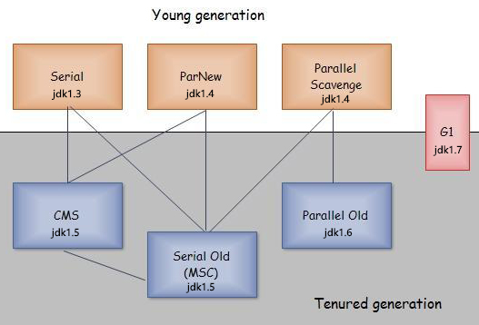
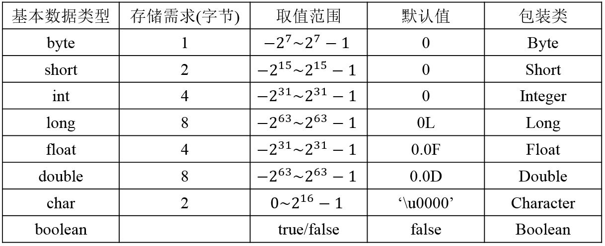
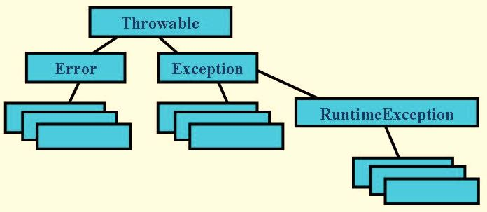

## 一、 Java概述

### 问：什么是Java虚拟机？为什么Java被称作是“平台无关的编程语言”？

Java源文件被javac编译成能被Java虚拟机执行的.class字节码文件，Java虚拟机是一个可以执行Java字节码的虚拟机进程，它拥有自己完善的硬体架构，如堆栈、寄存器，还具有相应的指令系统。

Java虚拟机对开发者屏蔽了与具体操作系统平台相关的信息，使得Java源文件只需要被编译成可以在JVM上运行的字节码文件，就可以由**相应平台的虚拟机**在具体平台上解释运行，从而实现一次编译，处处执行。这样，Java被设计成允许应用程序可以运行在任意的平台上，而不需要程序员为每一个平台单独重写或者是重新编译。

### 问：Java中垃圾回收有什么目的？什么时候进行垃圾回收？

垃圾回收的目的是**识别并回收堆内存**中不再使用的对象所占的内存，释放资源。而栈区的内存是随着线程结束而释放的。

触发主GC(Garbage Collector，垃圾回收)的条件：

(1) 当应用程序空闲时，即没有应用线程在运行时，GC会被调用。

(2) Java堆内存不足时，GC会被调用。

### 问：System.gc()和Runtime.gc()会做什么事情？

Java提供了垃圾回收机制来帮助我们不定时的回收堆中不再使用的对象。当JVM启动时，除了启动我们的主线程外，还会启动垃圾回收线程，它会在JVM空闲时，自动回收我们不再使用的对象，释放内存空间。

程序员不能强制执行垃圾回收，可以用这两个方法用来提示JVM要进行垃圾回收。但是，立即开始还是延迟进行垃圾回收是取决于JVM，即垃圾回收的具体时间和顺序是无法预知的。

### 问：垃圾回收器的演化

图 1

### 问：JDK和JRE的区别是什么？

Java运行时环境(JRE)包括Java虚拟机、Java核心类库和支持文件，JVM对Java字节码文件进行解释执行。只有JRE只能执行Java程序，不能进行java程序的开发。

Java开发工具包(JDK)是完整的Java软件开发包，包含了JRE，编译器和其他的工具(比如：JavaDoc，Java调试器)，可以让开发者开发、编译、执行Java应用程序。

## 二、 基础语法

## 三、 面向对象编程

## 四、 异常处理

## 五、 数组

## 六、 常用类

## 七、 容器

## 八、 流

## 九、 多线程

## 十、 网络编程

## 39. Java堆的结构是什么样子的？什么是堆中的永久代(Perm Gen space)?

JVM的堆是运行时数据区，所有类的实例和数组都是在堆上分配内存。它在JVM启动的时候被创建。对象所占的堆内存是由自动内存管理系统也就是垃圾收集器回收。

堆内存是由存活和死亡的对象组成的。存活的对象是应用可以访问的，不会被垃圾回收。死亡的对象是应用不可访问尚且还没有被垃圾收集器回收掉的对象。一直到垃圾收集器把这些对象回收掉之前，他们会一直占据堆内存空间。

虚拟机中的堆内存共划分为三个代：**年轻代（Young Generation）、年老代（Old Generation）和持久代（Permanent Generation）**。其中持久代主要存放的是Java类的类信息，与垃圾收集要收集的Java对象关系不大。年轻代和年老代的划分是对垃圾收集影响比较大的。

(1) **年轻代**:所有新生成的对象首先都是放在年轻代的。年轻代的目标就是尽可能快速的收集掉那些生命周期短的对象。Minor GC是针对新生代的回收。

年轻代分三个区:一个Eden区，两个Survivor区(一般而言)。

大部分对象在Eden区中生成。当Eden区满时，还存活的对象将被复制到Survivor区(两个中的一个)，当这个Survivor区满时，此区的存活对象将被复制到另外一个Survivor区，当这个Survivor去也满了的时候，从第一个Survivor区复制过来的并且此时还存活的对象，将被复制“年老区(Tenured)”。需要注意，Survivor的两个区是对称的，没先后关系，所以同一个区中可能同时存在从Eden复制过来对象，和从前一个Survivor复制过来的对象，而复制到年老区的只有从第一个Survivor去过来的对象。而且，Survivor区总有一个是空的。同时，根据程序需要，Survivor区是可以配置为多个的（多于两个），这样可以增加对象在年轻代中的存在时间，减少被放到年老代的可能。
  
(2) **年老代**:在年轻代中经历了N次垃圾回收后仍然存活的对象，就会被放到年老代中。因此，可以认为年老代中存放的都是一些生命周期较长的对象。Major GC/Full GC是针对年老代的回收。
  
(3) **持久代**:用于存放静态文件，如类、方法、final常量、static变量等。持久代对垃圾回收没有显著影响，但是有些应用可能动态生成或者调用一些class，例如Hibernate等，在这种时候需要设置一个比较大的持久代空间来存放这些运行过程中新增的类。持久代大小通过-XX:MaxPermSize=<N>进行设置。

## Java运行时数据区

Java运行时数据区包括：虚拟机栈区，堆区，方法区，本地方法栈，程序计数器

- 虚拟机栈区：也就是我们常说的栈区，**线程私有**，在编译期间完成分配，为虚拟机执行Java方法(也就是字节码)服务，每个方法在执行时会创建一个栈帧用于存放局部变量表、操作数栈、动态链接和方法出口等信息，每个方法的调用直至执行完成对应于栈帧的入栈和出栈；

- 堆区：JAVA堆，也称GC堆，在JVM启动时创建，**所有线程共享**，存放对象的实例和数组，是垃圾收集器管理的主要区域。"GC堆"，可以细分为新生代和老年代，新生代又可以细分为Eden空间、From Survivor空间和To Survivor空间；物理上可以不连续，但逻辑上连续，可以选择固定大小或者扩展。

- 方法区：**所有线程共享**，用于存储被虚拟机加载的类信息、常量、静态变量、即时编译器编译后的代码等数据。这个区域的内存回收目标主要是针对常量池中的对象的回收和堆类型的卸载。方法区被称为“永久代”，是因为HotSpot虚拟机的设计团队把GC分代收集扩展到方法区，即使用永久代来实现方法区，像GC管理Java堆一样管理方法区，从而省去专门为方法区编写内存管理代码，

- 本地方法栈(Native Method Stacks)：**线程私有**，与虚拟机栈所发挥的作用是非常相似的，其区别不过是虚拟机栈为虚拟机执行Java方法(也就是字节码)服务，而本地方法栈则是为虚拟机使用到的Native方法服务。虚拟机规范中对本地方法栈中的方法使用的语言、使用方式与数据结构并没有强制规定，因此具体的虚拟机可以自由实现它。甚至有的虚拟机（譬如Sun HotSpot虚拟机）直接就把本地方法栈和虚拟机栈合二为一。与虚拟机栈一样，本地方法栈区域也会抛出StackOverflowError和OutOfMemoryError异常。

- 程序计数器：**线程私有**，每个线程都有自己独立的程序计数器，用来指示下一条指令的地址，是当前线程所执行的字节码的行号指示器，如果线程正执行一个java方法，计数器记录下一条执行的虚拟机字节码指令的地址；如果线程正在执行的是Native方法，则计数器值为空；

- 运行时常量池：**线程共享**，是方法区的一部分，存放编译期Class文件中生成的各种字面量和符号引用。

## 面向对象设计方法主要特征

继承、封装、多态

### 封装

封装给对象提供了隐藏内部特性和行为的能力，对象可以提供一些能被其他对象访问的方法来改变它内部的数据。

Java中有3种修饰符：public，private和protected。每一种修饰符可以给位于同一个包或者不同包下面的其他对象赋予不同的访问权限。

下面列出了使用封装的一些好处：

> 通过隐藏对象的属性来保护对象内部的状态。
> 
> 提高了代码的可用性和可维护性，因为对象的行为可以被单独的改变或者是扩展。
> 
> 禁止对象之间的不良交互提高模块化。
> 
> 参考这个文档获取更多关于封装的细节和示例。

### 多态

多态是编程语言给不同的底层数据类型做相同的接口展示的一种能力。一个多态类型上的操作可以应用到其他类型的值上面。

### 继承

继承给对象提供了从基类获取字段和方法的能力。继承提供了代码的重用行，也可以在不修改类的情况下给现存的类添加新特性。

## 面向对象软件开发的优点有哪些

代码开发模块化，更易维护和修改；代码复用；增强代码的可靠性和灵活性；增加代码的可理解性；面向对象编程有很多重要的特性，比如：封装，继承，多态和抽象。

## 5. Java支持的数据类型有哪些？

Java语言支持的8种基本数据类型是：byte、short、int、long、float、double、boolean、char。

> Java中在定义类的成员变量时可以对其初始化，如果不对其初始化，Java使用默认值对其初始化；而局部变量在使用前则必须进行初始化，JVM不会进行默认值初始化。
> 
> Java中对象引用默认初始化值为null

图 2

Java中整数类型默认为int型。浮点数默认为double型。

## 类型转化

https://www.nowcoder.com/questionTerminal/4cefb62973b149478bedc0ebcdbfb160

java中如果碰到char、byte和short参与运算时，会自动将这些值转换为int类型然后再进行运算。

低级向高级是隐式类型转换，高级向低级必须强制类型转换，byte<char<short<int<long<float<double

## Java中的中文字符

Java语言中，中文字符所占的字节数取决于字符的编码方式，默认使用GBK编码方式。
	
	当采用ISO8859-1编码方式时，一个中文字符占1个字节；
	
	当采用GB2312或GBK编码方式时，一个中文字符占2个字节；
	
	当采用UTF-8编码方式时，一个中文字符会占3个字节。

Java字符默认使用unicode编码，每个字符占用两个字节。

注意：char与byte在Java和C++中的区别：
> 在C++中，char是基础数据类型，占1个字节；byte不是基础数据类型，一般定义为typedef unsigned char byte;也就是说，byte其实是unsigned char类型，那么也是占1个字节。不同的是，char可以表示的范围是-128-127，而byte可以表示的范围是0-255。
> 
> 在java中，char和byte都是基础数据类型，其中的byte占1个字节，可以表示的范围是-128-127。而char占2个字节，可以表示的范围是'\u0000'-'\uFFFF'。

## 基本数据类型的装箱与拆箱

自动装箱是Java编译器在基本数据类型和对应的包装类型之间做的一个转化，例如把int转化成Integer，double转化成Double，等等。反之就是自动拆箱。

> (1) 基本数据类型变量和基本数据类型封装类对象进行"=="运算符的比较，基本数据类型封装类对象将会自动拆箱变为基本数据类型后再进行比较，因此Integer(0)会自动拆箱为int类型再进行比较。

> (2) 两个Integer类型对象进行"=="比较，如果这两个对象的值在-128至127且值相等，那么返回true，否则返回false, 这跟Integer.valueOf()的缓冲对象有关。

> (3) 两个基本数据类型封装类变量进行equals()比较，equals()会首先比较对象的类型，如果类型相同，继续比较值，如果值也相同，返回true，否则返回false。

> (4) 基本数据类型封装类对象调用equals()，但是参数是基本数据类型变量，这时候，基本数据类型变量会先进行自动装箱转换为其封装类型对象，再进行3中的比较。

	int a=257;
	Integer b=257;
	Integer c=257;
	Integer b2=57;
	Integer c2=57;
	System.out.println(a==b); // true
	//System.out.println(a.equals(b));  编译出错，基本型不能调用equals()
	System.out.println(b.equals(257.0));// false
	System.out.println(b==c); // false
	System.out.println(b2==c2); // true

<b>

	public static void main(String[] args){    
		Boolean flag=false;//先调用Boolean.valueOf(boolean b)返回false对应的Boolean对象Boolean.FALSE，然后赋值给flag，flag值为Boolean.FALSE    
		/* 先赋值，遇到if条件表达式自动拆箱     
		 * 1. 先调用Boolean.valueOf(boolean b)返回true对应的Boolean对象Boolean.TRUE，然后赋值给flag，flag值为Boolean.TRUE     
		 * 2. 调用booleanValue()返回flag值对应的基础数据类型值true     
		 * 3. 结果输出true     
		 */    
		if (flag=true){        
			System.out.println("true");    
		}else{        
			System.out.println("false");    
		}
	}

## 抽象类和接口的区别

https://www.nowcoder.com/profile/7404313/test/7906972/15179?onlyWrong=0

含有abstract修饰符的class即为抽象类，abstract类不能创建的实例对象。含有abstract方法的类必须定义为abstract class，abstract class类中的方法不必是抽象的。abstract class类中定义抽象方法必须在具体(Concrete)子类中实现，所以，不能有抽象构造方法或抽象静态方法。如果的子类没有实现抽象父类中的所有抽象方法，那么子类也必须定义为abstract类型。  
接口（interface）可以说成是抽象类的一种特例，接口中的所有方法都必须是抽象的。接口中的方法定义默认为public abstract类型，接口中的成员变量类型默认为public static final。  
下面比较一下两者的语法区别：  
1.抽象类可以有构造方法，接口中不能有构造方法。  
2.抽象类中可以有普通成员变量，接口中没有普通成员变量  
3.抽象类中可以包含非抽象的普通方法，接口中的所有方法必须都是抽象的，不能有非抽象的普通方法。  
4. 抽象类中的抽象方法的访问类型可以是public，protected和（默认类型,虽然  
eclipse下不报错，但应该也不行），但接口中的抽象方法只能是public类型的，并且默认即为public abstract类型。  
5. 抽象类中可以包含静态方法，接口中不能包含静态方法 (java8开始接口可以有类方法和默认方法) 
6. 抽象类和接口中都可以包含静态成员变量，抽象类中的静态成员变量的访问类型可以任意，但接口中定义的变量只能是public static final类型，并且默认即为public static final类型。  
7. 一个类可以实现多个接口，但只能继承一个抽象类。

Java提供和支持创建抽象类和接口。它们的实现有共同点，不同点在于：

从设计层面来说，抽象是对类的抽象，是一种模板设计，接口是行为的抽象，是一种行为的规范。

> 接口中所有的方法隐含的都是抽象的(Java8中接口可以有非抽象的default方法)，而抽象类则可以同时包含抽象和非抽象的方法；
>
> 类可以实现很多个接口，但是只能继承一个抽象类
> 
> 类可以不实现抽象类和接口声明的所有方法，当然，在这种情况下，类也必须得声明成是抽象的；
> 
> Java接口中声明的变量默认都是final的，抽象类可以包含非final的变量；
> 
> Java接口中的成员函数默认是public的，抽象类的成员函数可以是private，protected或者是public；
> 
> 接口是绝对抽象的，不可以被实例化。抽象类也不可以被实例化，但是，如果它包含main方法的话是可以被调用的。

## Object类

Object类中包含如下方法：
	
	protected Object clone() 创建并返回此对象的一个副本。

	boolean	equals(Object obj) 指示其他某个对象是否与此对象“相等”。

	protected void finalize() 当垃圾回收器确定不存在对该对象的更多引用时，由对象的垃圾回收器调用此方法。

	Class<?> getClass() 返回此 Object 的运行时类。

	int	hashCode() 返回该对象的哈希码值。

	void notify() 唤醒在此对象监视器上等待的单个线程。

	void notifyAll() 唤醒在此对象监视器上等待的所有线程。

	String toString() 返回该对象的字符串表示。

	void wait() 在其他线程调用此对象的 notify()方法或notifyAll()方法前，导致当前线程等待。

	void wait(long timeout) 在其他线程调用此对象的notify()方法或notifyAll()方法，或者超过指定的时间量前，导致当前线程等待。
	
	void wait(long timeout, int nanos) 
	在其他线程调用此对象的notify()方法或notifyAll()方法，或者其他某个线程中断当前线程，或者已超过某个实际时间量前，导致当前线程等待。

## ==和equals

Object类中equals()方法默认行为是比较引用，任意类继承Object类后，equals()方法默认比较的是引用；

## 访问控制符

Java类的成员默认为default访问权限。

图 1

## redirect和forward

redirect是客户端跳转，跳转后页面地址栏会发生改变

> 当浏览器访问地址A时，sendRedirect()方法会让客户端创建一个新的请求去访问另外一个地址B，重定向(redirect)以后，客户端浏览器地址栏中的地址显示的是地址B，因为会产生一个新的请求，之前请求作用域范围以内的对象就失效了，因此这个方式地址A和地址B之间不能共享数据。 

forward是服务器跳转，跳转后页面的地址栏不会改变

> 当浏览器访问地址A时，地址A先处理请求，forward()方法会让地址A去寻找地址B，让地址B接着去处理请求。forward()方法只是把请求转发到一个新的目标上，而转发(forwarding)以后，之前请求作用域范围以内的对象还是能访问的，这个方式浏览器地址栏显示的一直是地址A，两个地址之间能共享数据。

一般认为sendRedirect()比forward()要慢。

## java语言中的几种数组复制方法效率比较
System.arraycopy > clone > Arrays.copyOf > for循环

##

	public class Demo {
	    public static void main(String args[]) {
	        String str1 = new String("hello");
	        String str2 = new String("hello");
	        String str3 = "hello";
	        String str4 = "hello";
	        String str5 = "he"+"llo";
	        String str6 = "he";
	        String str7 = "llo";
	        System.out.println(str1==str2);        //false
	        System.out.println(str1==str3);        //false
	        System.out.println(str3==str4);        //true
	        System.out.println(str3=="hello");     //true
	        System.out.println(str4==(str6+str7)); //false
	    }
	}

## Java Socket

	getInetAddress()      Returns the address to which the socket is connected.      
    getLocalAddress()     Gets the local address to which the socket is bound.      
    getReuseAddress()     Tests if SO_RESUSADDR is enabled.      
    getLocalPort()        Returns the remote port number to which this socket is connected.

## 6. Java中的方法重写(Overriding)和方法重载(Overloading)是什么意思？

(1) 方法重载是一个类中多态性的一种表现，发生在同一个类里面两个或多个方法的方法名相同但是参数不同的情况。
> 函数名必须相同；
> 
> 函数参数列表必须不相同，可以是参数类型、参数顺序或者参数个数不同；
> 
> 函数的返回值类型、修饰符可以相同，也可以不相同；

(2) 方法重写是父类与子类之间多态性的一种表现，是说子类重新定义了父类的方法；方法的重写满足两同两小一大原则
> 方法名相同，参数类型相同
> 
> 子类返回类型小于等于父类方法返回类型；
> 
> 子类抛出异常小于等于父类方法抛出异常；
> 
> 子类访问权限大于等于父类方法访问权限 (public>protected>defualt(默认修饰符)>private)。

## 7. Java中，什么是构造函数？什么是构造函数重载？什么是复制构造函数？

Java中每一个类都有构造函数，当类对象被创建的时候，类的构造函数就会被调用，完成对象的初始化工作，它能够把定义对象时的参数传给对象的域。

构造函数是一种特殊的方法，具有以下特点:
>
> (1) 构造函数的方法名必须与类名相同；
>
> (2) 构造函数没有返回类型，也不能定义为void；
>
> (3) 一个类可以定义多个构造函数，如果在定义类时没有定义构造函数，则编译系统会自动插入一个无参数的默认构造函数，这个构造器不执行任何代码；
>
>(4) 构造方法可以重载，以参数的个数，类型，顺序进行区分。

Java中构造函数重载和方法重载很相似，可以为一个类创建多个构造函数，每一个构造函数必须有它自己唯一的参数列表。

Java不支持像C++中那样的复制构造函数，但是这并不代表Java中没有这种机制，在Java中Object类的clone()方法就是这种机制的体现。

#### 11. 进程和线程的区别是什么？

进程资源分配的基本单位，而线程是CPU调度的基本单位。一个进程可以有多个线程，多个线程共享进程的资源，线程又叫做轻量级进程。

#### 12. 创建线程有几种不同的方式？你喜欢哪一种？为什么？

有三种方式可以用来创建线程：继承Thread类、实现Runnable接口、应用程序可以使用Executor/Callable/Future框架来创建线程池。

实现Runnable接口这种方式更受欢迎。在应用设计中线程类已经继承了别的类的情况下，需要多继承，只能实现接口（而Java不支持多继承，却支持实现多个接口），这样就不再需要继承Thread类，避免单继承的局限。同时，线程池也是非常高效的，很容易实现和使用。

## Java四种线程池的使用
(1) ExecutorService java.util.concurrent.Executors.newSingleThreadExecutor()

Creates an Executor that uses a single worker thread operating off an unbounded queue. (Note however that if this single thread terminates due to a failure during execution prior to shutdown, a new one will take its place if needed to execute subsequent tasks.) Tasks are guaranteed to execute sequentially, and no more than one task will be active at any given time. Unlike the otherwise equivalent newFixedThreadPool(1) the returned executor is guaranteed not to be reconfigurable to use additional threads.

Returns:
the newly created single-threaded Executor

创建一个单线程化的线程池，它只会用唯一的工作线程来执行任务，保证所有任务按照指定顺序(FIFO, LIFO, 优先级)执行。

示例代码：

	import java.util.concurrent.ExecutorService;
	import java.util.concurrent.Executors;
	
	public class NewSingleThreadExecutor {
		public static void main(String[] args) {
			ExecutorService singleThreadExecutor = Executors.newSingleThreadExecutor();
			for (int i = 0; i < 10; i++) {
				final int index = i;
				singleThreadExecutor.execute(new Runnable() {
					public void run() {
						try {
							System.out.println(index);
							Thread.sleep(2000);
						} catch (InterruptedException e) {
							e.printStackTrace();
						}
					}
				});
			}
		}
	}
	
	// 顺序执行各个任务，依次输出结果

(2) ExecutorService java.util.concurrent.Executors.newFixedThreadPool(int nThreads)

创建一个含有固定数量线程的线程池，可控制最大并发任务数，超出的任务会在队列中等待。

`Creates a thread pool that reuses a fixed number of threads operating off a shared unbounded queue. At any point, at most nThreads threads will be active processing tasks. If additional tasks are submitted when all threads are active, they will wait in the queue until a thread is available. If any thread terminates due to a failure during execution prior to shutdown, a new one will take its place if needed to execute subsequent tasks. The threads in the pool will exist until it is explicitly shutdown.

Parameters:
nThreads the number of threads in the pool

Returns:
the newly created thread pool

	import java.util.concurrent.ExecutorService;
	import java.util.concurrent.Executors;
	
	public class NewFixedThreadPool {
		public static void main(String[] args) {
			ExecutorService fixedThreadPool = Executors.newFixedThreadPool(3);
			for (int i = 0; i < 10; i++) {
				final int index = i;
				fixedThreadPool.execute(new Runnable() {
					public void run() {
						try {
							System.out.println(index);
							Thread.sleep(2000);
						} catch (InterruptedException e) {
							e.printStackTrace();
						}
					}
				});
			}
		}
	}

	// 因为线程池大小为3，每个线程输出index后sleep 2秒，所以每隔两秒打印3个数字

(3) ExecutorService java.util.concurrent.Executors.newCachedThreadPool()

Creates a thread pool that creates new threads as needed, but will reuse previously constructed threads when they are available. These pools will typically improve the performance of programs that execute many short-lived asynchronous tasks. Calls to execute will reuse previously constructed threads if available. If no existing thread is available, a new thread will be created and added to the pool. Threads that have not been used for sixty seconds are terminated and removed from the cache. Thus, a pool that remains idle for long enough will not consume any resources. Note that pools with similar properties but different details (for example, timeout parameters) may be created using ThreadPoolExecutor constructors.

Returns:
the newly created thread pool

	import java.util.concurrent.ExecutorService;
	import java.util.concurrent.Executors;
	
	public class ThreadPoolExecutorTest {
		public static void main(String[] args) {
			ExecutorService cachedThreadPool = Executors.newCachedThreadPool();
			for (int i = 0; i < 10; i++) {
				final int index = i;
				try {
					Thread.sleep(index * 1000);
				} catch (InterruptedException e) {
					e.printStackTrace();
				}
				cachedThreadPool.execute(new Runnable() {
					public void run() {
						System.out.println(index);
					}
				});
			}
		}
	}

(4) ScheduledExecutorService java.util.concurrent.Executors.newScheduledThreadPool(int corePoolSize)

创建一个含有固定数量线程的线程池，支持延时任务或周期性任务的执行。

Creates a thread pool that can schedule commands to run after a given delay, or to execute periodically.

Parameters:
corePoolSize the number of threads to keep in the pool, even if they are idle
Returns:
a newly created scheduled thread pool
Throws:
IllegalArgumentException - if corePoolSize < 0

执行延时任务的示例代码：

	import java.util.concurrent.Executors;
	import java.util.concurrent.ScheduledExecutorService;
	import java.util.concurrent.TimeUnit;
	
	public class NewScheduledThreadPool1 {
		public static void main(String[] args) {
			ScheduledExecutorService scheduledThreadPool = Executors.newScheduledThreadPool(5);
			scheduledThreadPool.schedule(new Runnable() {
				public void run() {
					System.out.println("delay 3 seconds");
				}
			}, 3, TimeUnit.SECONDS);
		}
	}

	// 表示延迟3秒执行任务

执行定期性任务的示例代码：

	import java.util.concurrent.Executors;
	import java.util.concurrent.ScheduledExecutorService;
	import java.util.concurrent.TimeUnit;
	
	public class NewScheduledThreadPool2 {
		public static void main(String[] args) {
			ScheduledExecutorService scheduledThreadPool = Executors.newScheduledThreadPool(5);
			scheduledThreadPool.scheduleAtFixedRate(new Runnable() {
				public void run() {
					System.out.println("delay 1 seconds, and excute every 3 seconds");
				}
			}, 1, 3, TimeUnit.SECONDS);
		}
	}

	// 表示延迟1秒后，每3秒执行一次任务

#### 13. 概括的解释下线程的几种可用状态。

**(1) 新建(new)**：新创建了一个线程对象。

**(2) 可运行(runnable)**：线程对象创建后，其他线程(比如main线程)调用了该对象的start()方法，该状态的线程便位于可运行线程池中，等待被线程调度选中，获取cpu的使用权。

**(3) 运行(running)**：可运行状态(runnable)的线程获得了cpu时间片(timeslice)，执行程序代码。

**(4) 阻塞(block)**：阻塞状态是指线程因为某种原因放弃了cpu使用权，也即让出了cpu timeslice，暂时停止运行。直到线程进入可运行(runnable)状态，才有机会再次获得cpu timeslice转到运行(running)状态。阻塞的情况分三种：
> 等待阻塞：运行(running)的线程执行o.wait()方法，JVM会把该线程放入等待队列(waitting queue)中。
> 
> 同步阻塞：运行(running)的线程在获取对象的同步锁时，若该同步锁被别的线程占用，则JVM会把该线程放入锁池(lock pool)中。
> 
> 其他阻塞: 运行(running)的线程执行Thread.sleep(long ms)或t.join()方法，或者发出了I/O请求时，JVM会把该线程置为阻塞状态。            

当sleep()状态超时、 join()等待线程终止或者超时、或者I/O处理完毕时，线程重新转入可运行(runnable)状态。

**(5) 死亡(dead)**：线程run()、 main()方法执行结束，或者因异常退出了run()方法，则该线程结束生命周期。死亡的线程不可再次复生。

#### 14. 同步方法和同步代码块的区别是什么？

Java允许多线程并发控制，当多个线程同时操作一个可共享的资源变量时(增删改查)，将会导致数据的不准确，相互之间产生冲突。因此加入了同步锁，以避免在该线程没有结束前，其他线程操作该资源变量，从而保证了变量的唯一性，准确性。

Java中每个对象都有一把锁，线程可以通过synchronized关键字来获取对象上的锁。

**(1) 同步方法(粗粒度锁)：**:由synchronized关键字修饰的方法，同步方法默认用this或者当前类class对象作为锁
> 修饰一般方法:public synchronized void method(){...}，获取的是当前调用对象this上的锁
>  
> 修饰静态方法:public static synchronized void method(){...}，获取当前类的字节码对象上的锁 

**(2) 同步代码块(细粒度锁)：**: 由synchronized关键字修饰的语句块，同步代码块可以选择以什么语句块来加锁，比同步方法要更细颗粒度，我们可以选择只同步会发生同步问题的部分代码而不是整个方法
> synchronized(obj) {...}，同步代码块可以指定获取哪个对象上的锁。

## 15. wait、notify、notifyAll

- wait()

(1) 该方法用来让当前线程进入休眠状态，直到被唤醒或被中断为止。

(2) 在调用wait()之前，线程必须要获得该对象的对象级别锁，即只能在同步方法或同步块中调用wait()方法。如果调用wait()时，线程没有持有适当的锁，则抛出IllegalMonitorStateException，它是RuntimeException的一个子类，因此，不需要try-catch结构。

(3) 进入wait()方法后，当前线程释放锁。在从 wait()返回前，线程与其他线程竞争重新获得锁。

- notify()

(1) 该方法也要在同步方法或同步块中调用，即在调用前，线程也必须要获得该对象的对象级别锁，如果调用notify()时线程没有持有适当的锁，也会抛出IllegalMonitorStateException。

(2) 该方法用来唤醒那些可能等待该对象的对象锁的其他线程。如果有多个线程等待，则线程调度器任意挑选出其中一个wait()状态的线程来发出通知，并使它等待获取该对象的对象锁（notify后，发出通知的当前线程不会马上释放该对象锁，wait所在的线程并不能马上获取该对象锁，要等到程序退出synchronized代码块后，当前线程才会释放锁，wait所在的线程也才可以获取该对象锁），但不惊动其他同样在等待被该对象notify的线程们。

(3) 当第一个获得了该对象锁的wait线程运行完毕以后，它会释放掉该对象锁，此时如果该对象没有再次使用notify 语句，则即便该对象已经空闲，其他wait状态等待的线程由于没有得到该对象的通知，会继续阻塞在wait状态，直到这个对象发出一个notify或notifyAll。这里需要注意：它们等待的是被notify或notifyAll，而不是锁。这与下面的 notifyAll()方法执行后的情况不同。

- notifyAll()

该方法与 notify ()方法的工作方式相同，重要的一点差异是：
notifyAll 使所有原来在该对象上 wait 的线程统统退出 wait 的状态（即全部被唤醒，不再等待notify或notifyAll，但由于此时还没有获取到该对象锁，因此还不能继续往下执行），开始等待获取该对象上的锁，一旦该对象锁被释放（notifyAll线程退出调用了notifyAll的synchronized代码块的时候），他们就会去竞争。如果其中一个线程获得了该对象锁，它就会继续往下执行，在它退出synchronized代码块，释放锁后，其他的已经被唤醒的线程将会继续竞争获取该锁，一直进行下去，直到所有被唤醒的线程都执行完毕。

总结：如果线程调用了对象的 wait()方法，那么线程便会处于该对象的等待池中，等待池中的线程不会去竞争该对象的锁。当有线程调用了对象的 notifyAll()方法（唤醒所有 wait 线程）或 notify()方法（只随机唤醒一个 wait 线程），被唤醒的的线程便会进入该对象的锁池中，锁池中的线程会去竞争该对象锁。优先级高的线程竞争到对象锁的概率大，假若某线程没有竞争到该对象锁，它还会留在锁池中，唯有线程再次调用wait()方法，它才会重新回到等待池中。而竞争到对象锁的线程则继续往下执行，直到执行完了 synchronized 代码块，它会释放掉该对象锁，这时锁池中的线程会继续竞争该对象锁。

案例：当前线程调用对象的notify后，当前线程不会马上释放该对象锁，wait所在的线程并不能马上获取该对象锁，要等到程序退出synchronized代码块后，当前线程才会释放锁，wait所在的线程也才可以获取该对象锁。

	public static void main(String[]args)throws Exception {
	    final Object obj = new Object();
	    Thread t1 = new Thread() {
	        public void run() {
	            synchronized (obj) {
	                try {
	                    obj.wait();
	                    System.out.println("Thread 1 wake up.");
	                } catch (InterruptedException e) {
	                }
	            }
	        }
	    };
	    t1.start();
	    Thread.sleep(1000);//We assume thread 1 must start up within 1 sec.
	    Thread t2 = new Thread() {
	        public void run() {
	            synchronized (obj) {
	                obj.notifyAll();
	                System.out.println("Thread 2 sent notify.");
	            }
	        }
	    };
	    t2.start();
	}

	output:
	Thread 2 sent notify.
	Thread 1 wake up

## Java集合框架中线程安全的类
Vector、Stack(它继承了Vector)、Hashtable、Enumeration

#### 22. 快速失败(fail-fast)和安全失败(fail-safe)的区别是什么？

快速失败：当你在迭代一个集合的时候，如果有另一个线程正在修改你正在访问的那个集合时，就会抛出一个ConcurrentModification异常。

安全失败：你在迭代的时候会对底层集合做一个拷贝，所以有另一个线程在修改上层集合的时候，访问是不会受影响的，不会抛出ConcurrentModification异常。

> Iterator的安全失败是基于对底层集合做拷贝，因此，它不受源集合上修改的影响。
> 
> java.util包下面的所有的集合类都是快速失败的，而java.util.concurrent包下面的所有的类都是安全失败的。
> 
> 快速失败的迭代器会抛出ConcurrentModificationException异常，而安全失败的迭代器永远不会抛出这样的异常。

## 25. HashMap和Hashtable有什么区别？

HashMap和Hashtable都实现了Map接口，因此很多特性非常相似。但是，他们有以下不同点：

> HashMap允许键和值是null，而Hashtable不允许键或者值是null。
> 
> Hashtable是同步的，而HashMap不是，即HashMap是非线程安全的，HashTable是线程安全的。因此，HashMap更适合于单线程环境，而Hashtable适合于多线程环境。因为线程安全的问题，HashMap效率比HashTable的要高。
> 
> HashMap提供了可供应用于迭代的键的集合，因此，HashMap是快速失败的。另一方面，Hashtable提供了对键的列举(Enumeration)，是安全失败的。

一般现在不建议用HashTable
> (1) HashTable是遗留类，内部实现很多没优化和冗余。
> 
> (2) 即使在多线程环境下，现在也有同步的ConcurrentHashMap替代，没有必要因为是多线程而用HashTable。

CopyOnWriteArrayList/ReadWriteLock  2017/4/14 20题

## synchronized

https://www.nowcoder.com/profile/7404313/test/7906972/14929?onlyWrong=0

## 26. 数组(Array)和列表(ArrayList)的区别？什么时候应该使用Array而不是ArrayList？

(1) Array可以包含基本类型和对象类型，ArrayList只能包含对象类型。(但是需要注意的是：Array数组在存放的时候一定是同种类型的元素；ArrayList就不一定了，因为ArrayList可以存储Object。)

(2) Array大小是固定的，ArrayList的大小是动态变化的。

(3) ArrayList提供了更多的方法和特性，比如：addAll()，removeAll()，iterator()等等。

对于基本类型数据，ArrayList使用自动装箱来减少编码工作量。但是，当处理固定大小的基本数据类型的时候，这种方式相对比较慢。

## 27. ArrayList和LinkedList有什么区别？

ArrayList和LinkedList都实现了List接口，他们有以下的不同点：

(1) ArrayList是基于索引的数据接口，它的底层是数组。它可以以O(1)时间复杂度对元素进行随机访问。与此对应，LinkedList是以链表的形式存储它的数据，每一个元素都和它的前一个和后一个元素链接在一起，在这种情况下，查找某个元素的时间复杂度是O(n)。

(2) 相对于ArrayList，LinkedList的插入、添加、删除操作速度更快，因为当元素被添加到集合任意位置的时候，不需要像数组那样重新计算大小或者是更新索引。

(3) LinkedList比ArrayList更占内存，因为LinkedList为每一个节点存储了两个引用，一个指向前一个元素，一个指向下一个元素。

## ArrayList容量

ArrayList的构造函数总共有三个

- ArrayList()构造一个初始容量为 10 的空列表，动态增长时，容量增长到当前容量的1.5倍

- ArrayList(Collection<? extends E> c)
构造一个包含指定collection的元素的列表，这些元素是按照该collection的迭代器返回它们的顺序排列的。

- ArrayList(int initialCapacity)构造一个具有指定初始容量的空列表。

## 43. Java中的两种异常类型是什么？他们有什么区别？

Throwable包含了错误(Error)和异常(Excetion)两类。

图 1

(1) Error： 由Java虚拟机生成并抛出，属于JVM底层或者运行时环境的错误，程序无法预测和捕获处理，如OutOfMemoryError，如果出现Error，Java虚拟机会终止执行。

(2) Exception: 用户程序可以捕获的异常情况，Java中有两种异常，分别为运行时异常(RuntimeException, 又叫非检查异常)和非运行时异常(又叫检查异常)。

- **运行时异常**：RuntimeException类及其子类，如ArithmeticException、NullPointerException、IndexOutOfBoundsException等，这类异常是在程序运行的时候可能会发生的，Java编译器不去检查它，也就是说，当程序中可能出现这类异常时，即使没有用try...catch语句捕获它，也没有用throws字句声明抛出它，还是会编译通过。所以程序可以捕捉，也可以不捕捉。这些异常一般是由程序的逻辑错误引起的，其产生频繁，处理麻烦，若显示申明或者捕获将会对程序的可读性和运行效率影响很大，建议不要用try...catch...捕获处理，程序应该在开发调试的过程中从逻辑角度去尽量避免，例如：空值处理。
 
- **非运行时异常**：运行时异常以外的异常，也是Exception及其子类，这些异常从程序的角度来说是必须经过捕捉检查处理的(要么用 try...catch捕获处理，要么用throws语句声明抛出), 否则不能通过编译. 如IOException、SQLException、NoSuchMetodException、ClassNotFoundException、FileNotFoundException等。

## 45. throw和throws有什么区别？

throw关键字用来**在方法内部**明确地抛出异常，后面跟的是要抛出的**异常对象**且只能跟一个异常对象；相反，throws关键字用**在声明方法上**，表示该方法可能要抛出的、该方法不能处理的异常，后面跟的是**异常类名**，可以有多个，用逗号隔开，这样方法的调用者才能够确保处理可能发生的异常。

##  异常处理语句的语法规则

(1) try代码块中包含可能产生异常的代码，其后跟一个或多个catch代码块，每个catch代码块用于捕获并处理一种特定类型的异常。

(2) 当try代码块中产生异常时，程序会终止当前的执行流程，Java虚拟机会把实际抛出的异常对象依次和各个catch代码块声明的异常类型匹配，如果异常对象为某个异常类型或其子类的实例，就执行这个catch代码块，然后其他的catch代码块将不会再执行，即一个异常只能被一个catch代码块捕获执行。如果catch代码块没有异常产生，所有的catch代码块将跳过不执行。

(5) catch代码块后可以跟finally代码块，无论try代码块中是否抛出异常，finally代码块都会被执行，因此finally代码块为异常处理提供一个统一的出口，使得在控制流程跳转到程序的其他部分之前，能够对程序的状态作统一的管理。通常在finally代码块中可以进行资源的清除工作。

(4) try代码块后基类异常的捕获语句不可以写在子类异常捕获语句的上面。

(5) 在try-catch-finally结构中，可重新抛出异常。 

(6) try-catch-finally结构可嵌套。 

## 46. finally

finally作为异常处理的一部分，只能用在try/catch语句块后，无论是否抛出异常，finally代码块都会执行，它主要是用来释放应用占用的资源。

实例1：当程序执行到try{}语句中的return方法时，它将要返回的结果存储到一个临时栈中，然后程序不会立即返回，而是去执行finally{}中的代码，在执行`a = 2`时，程序仅仅是覆盖了a的值，但不会去更新临时栈中的那个要返回的值。finally{}执行完之后，程序就会将临时栈中的值取出来返回。

	public abstract class Test {
	    public static void main(String[] args) {
	        System.out.println(beforeFinally());  // output: 1
	    }
	     
	    public static int beforeFinally(){
	        int a = 0;
	        try{
	            a = 1;
	            return a;
	        }finally{
	            a = 2;
	        }
	    }
	}
 
案例2：这里finally{}里也有一个return，那么在执行这个return时，就会更新临时栈中的值。同样，在执行完finally之后，程序将临时栈中的值取出来返回，即返回值是2.

	public abstract class Test {
	    public static void main(String[] args) {
	        System.out.println(beforeFinally());  //output: 2
	    }
	     
	    public static int beforeFinally(){
	        int a = 0;
	        try{
	            a = 1;
	            return a;
	        }finally{
	            a = 2;
	            return a;
	        }
	    }
	}
 
案例3：try/catch可以捕获并处理异常，异常被捕获后程序可以继续向后执行

	public class Test {
		public static void main(String[] args) {
			try {
				int i = 100 / 0;
				System.out.print(i);
			} catch (Exception e) {
				System.out.print(1);
			} finally {
				System.out.print(2);
			}
			System.out.print(3);
		}
	}
	// output: 123

 
案例4：catch语句块里面，打印完1之后，又抛出了一个RuntimeException，程序并没有处理它，而是直接抛出，因此执行完finally语句块之后，程序便不往下执行直接终止了

	public class Test {
		public static void main(String[] args) {
			try {
				int i = 100 / 0;
				System.out.print(i);
			} catch (Exception e) {
				System.out.print(1);
				throw new RuntimeException();
			} finally {
				System.out.print(2);
			}
			System.out.print(3);
		}
	}
	// output: 12

## 94. 解释下Servlet的生命周期。

生命周期：加载实例化 -> 初始化 -> 处理请求 -> 销毁

当有多个线程并发访问同一个Servlet，服务器Servlet容器会载入Servlet类，调用Servlet构造函数创建一个Servlet对象，并且只会创建一个Servlet实例，第一次创建的时候会调用init()方法完成Servlet的初始化；接着对其他线程的并发访问，容器会开几个线程调用该Servlet的service()方法来处理每一个请求；最后，调用Servlet的destroy()方法把Servlet删除掉。

#### 95. GenericServlet和HttpServlet有什么区别？

GenericServlet是一个通用的协议无关的Servlet，它实现了Servlet和ServletConfig接口。继承自GenericServlet的Servlet应该要覆盖service()方法。

HttpServlet类继承了GeneriServlet类，它提供了灵活处理HTTP请求的方法。

#### 96. doGet()方法和doPost()方法有什么区别？

HTTP常用的请求方式：GET和POST。

> GET方法会把名值对追加在请求的URL后面。因为URL对字符数目有限制，该方法会限制客户端请求的参数值的数目；此外，请求中的参数值是以明文方式传输，因此，敏感信息不能用这种方式传递。
> 
> POST方法通过把请求参数值放在请求体中来克服GET方法URL长度的限制，因此，可以发送的参数的数目是没有限制的。最后，通过POST请求传递的敏感信息对外部客户端是不可见的。

doGet()方法处理GET请求，doPOST()方法处理POST请求。

##

链接：https://www.nowcoder.com/questionTerminal/7676c6f03b134cad8870c6899bc695aa
来源：牛客网

Java中数组是对象，不是基本数据类型（原生类），大小不可变且连续存储，因为是对象所以存在堆中。

## Math.round(double a)
Math.round(a)=(long)floor(a+0.5d)；将原来的数字加上0.5后再向下取整，注意向下是指小于等于它的最大整数。

	Math.round(6.4)=(long)floor(6.4+0.5d)=(long)floor(6.9)=6
	Math.round(6.9)=(long)floor(6.9+0.5d)=(long)floor(7.4)=7
	Math.round(6.5)=(long)floor(6.5+0.5d)=(long)floor(7.0)=7

	Math.round(-6.4)=(long)floor(-6.4+0.5d)=(long)floor(-5.9)=-6
	Math.round(-6.9)=(long)floor(-6.9+0.5d)=(long)floor(-6.4)=-7
	Math.round(-6.5)=(long)floor(-6.5+0.5d)=(long)floor(-6.0)=-6

	Math.round(NaN)=0
	Math.round(<=Long.MIN_VALUE)=Long.MIN_VALUE
	Math.round(>=Long.MAX_VALUE)=Long.MAX_VALUE

##
Web service是跨平台，跨语言的远程调用技术；它的通信机制实质就是xml数据交换;
它采用了soap协议（简单对象协议）进行通信

## String、StringBuffer和StringBuilder

https://www.nowcoder.com/questionTerminal/8565927fcf3245f09bc119bd54842ffe

## JSP内置对象

https://www.nowcoder.com/profile/7404313/test/7906972/14780?onlyWrong=0

## 设计模式

http://www.cnblogs.com/beijiguangyong/archive/2010/11/15/2302807.html

## 关键字和保留字

1. const和goto既是保留字又是关键字
2. 除了const和goto，其余保留字和关键字是严格区分开的。

链接：https://www.nowcoder.com/questionTerminal/dc5651a872ff44a187afd7034a1708ba
来源：牛客网

1，Java 关键字列表 (依字母排序 共50组)： 
  abstract, assert, boolean, break, byte, case, catch, char, class,
  const（保留关键字）, continue, default, do, double, else,
  enum, extends, final, finally, float, for,
  goto（保留关键字）, if, implements, import, instanceof, int,
  interface, long, native, new, package, private, protected, public,
  return, short, static, strictfp, super, switch, synchronized, this,
  throw, throws, transient, try, void, volatile, while 
  2，保留字列表 (依字母排序
  共14组)，Java保留字是指现有Java版本尚未使用，但以后版本可能会作为关键字使用： 
  byValue, cast, false, future, generic, inner,
  operator, outer, rest, true, var, goto
  （保留关键字）
  , 
  const
  （保留关键字）
  , 
  null

##

链接：https://www.nowcoder.com/questionTerminal/7e391239d19a4f37b702de1e41187b1b
来源：牛客网

两个数值进行二元操作时，会有如下的转换操作： 
  如果两个操作数其中有一个是double类型，另一个操作就会转换为double类型。 
  否则，如果其中一个操作数是float类型，另一个将会转换为float类型。 
  否则，如果其中一个操作数是long类型，另一个会转换为long类型。 
  否则，两个操作数都转换为int类型。

	链接：https://www.nowcoder.com/questionTerminal/7e391239d19a4f37b702de1e41187b1b
来源：牛客网

	public static void main(String[] args){
	        int i=42;
	        double d=42.0000;
	        long l=42;
	        float f=42.0f;
	        float f2=42.00f;
	        System.out.println(d==i);
	        System.out.println(f==i);
	        System.out.println(f==f2);
	        System.out.println(l==i);
	        System.out.println(d==f);
	    }
	/*out:
	true
	true
	true
	true
	true
	*/

截止JDK1.8版本,java并发框架支持锁包括：读写锁、自旋锁、乐观锁

http://ifeve.com/java_lock_see1/

## super和this

在子类构造方法中，使用super()调用的是其父类的构造方法，而使用this()调用的是同一个类中重载的构造方法

super

(1) Java中子类不能继承父类的构造方法，只能调用父类构造方法；

(2) 子类的构造方法可以使用super显示地调用父类构造方法；

(3) 当子类构造方法中没有使用super来显示地调用父类构造方法时，系统会默认采用super()调用父类的无参构造方法，这时父类必须提供无参构造参数，否则编译出错。

this

注意：

(1) 使用super或者this时，它们必须放在构造方法的第一行；

(2) 由于this()调用的构造函数默认调用super()方法，所以规定this()和super()不能同时出现在一个构造函数中。