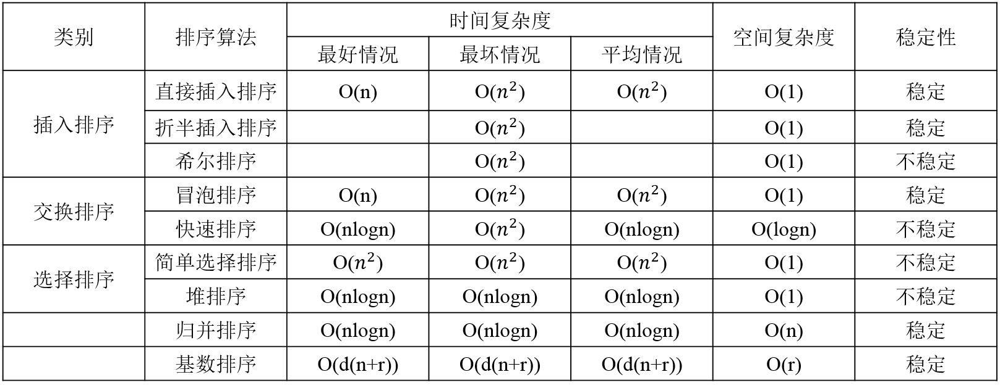
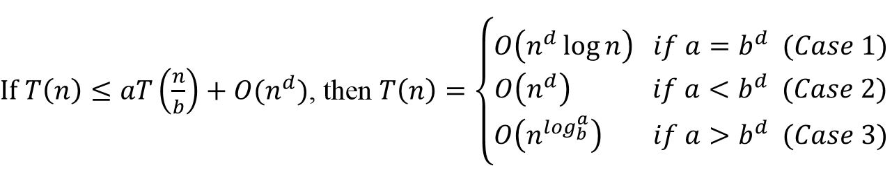

## 算法的5个基本特征
确定性、有穷性、输入、输出、可行性。

##2. 数据的逻辑结构与存储结构

逻辑结构：表示的是元素之间的关系，通常分为线性结构和非线性结构

物理结构：表示的是元素存储位置间的关系，通常分为顺序结构，链式结构，索引结构，哈希结构；

## 线性结构与非线性结构

线性结构与非线性结构，主要看元素之间的关系，如果是一对一的关系则是线性表，如果不是一对一的关系则是非线性表。

数据结构中线性结构指的是数据元素之间存在着“一对一”的线性关系的数据结构。线性结构是一个数据元素的有序（次序）集合。它有四个基本特征：

(1) 集合中必存在唯一的一个"第一个元素"；

(2) 集合中必存在唯一的一个"最后的元素"；

(3) 除最后元素之外，其它数据元素均有唯一的"后继"；

(4) 除第一元素之外，其它数据元素均有唯一的"前驱"。

相对应于线性结构，非线性结构的逻辑特征是一个结点元素可能对应多个直接前驱和多个直接后继。

## 顺序存储结构和链式存储结构

顺序存储结构的主要特点：

(1) 结点中只有自身的信息域，没有关联信息域。因此，顺序存储结构的存储密度大、存储空间利用率高。 

(2) 通过计算地址直接访问任何数据元素，即可以随机访问。
 
(3) 插入和删除操作会引起大量元素的移动。 

链式存储结构的主要特点是： 

(1) 结点除自身的信息域外，还有表示关联信息的指针域。因此，链式存储结构的存储密度小、存储空间利用率低。 

(2) 在逻辑上相邻的结点在物理上不必相邻，因此，不可以随机存取，只能顺序存取。 

(3) 插入和删除操作方便灵活，不必移动结点只需修改结点中的指针域即可。

##1. 平衡二叉树是平衡二叉排序树

##3. 完全二叉树的几个性质
(1) 完全二叉树中，编号为i的结点，其父节点为[i/2]（向下取整）。 

(2) 完全二叉树中，编号为i的结点，有如下四个性质（1<=i<=n，n为结点个数） 

- 判断编号为i的结点是叶子结点，还是分支结点：若2*i<=n，则结点i为分支结点，否则为叶子结点。 
- 分支结点的左右孩子情况，以及最大分支结点编号
	
	若n为奇数，则所有分支结点都有左右孩子。 
	
	若n为偶数，则编号为[n/2]（向下取整）的结点，只有左孩子，没有右孩子；其余分支结点左右孩子都有。

	最大分支结点编号都是[n/2]（向下取整）。

- 编号为i的结点如果有左孩子，则左孩子编号为2i；如果有右孩子，则右孩子的编号为2i+1
- 编号为i的结点的父结点编号为[i/2]（向下取整）（根节点除外）

##4. 循环队列
元素个数=(尾指针-头指针+容量)%容量

##5. 各种排序算法性质

图 1

注意：

(1) 堆排序建堆时间复杂度为O(n)，每次调整时间复杂度为O(h)

(2) 在排序中关键字比较次数同记录初始排列无关的算法有：选择排序、基数排序、折半插入排序

(3) (假设根节点序号为1)小根堆中最大的数一定在叶子节点上，堆本身是个完全二叉树，完全二叉树的叶子节点的位置大于[n/2]

(4) 希尔排序，也称为递减增量排序算法，是插入排序的一种高速而稳定的改进版本。

希尔排序是基于插入排序的以下两点性质而提出改进方法的： 
> 插入排序在对几乎已经排好序的数据操作时，效率高，即可达到线性排序的效率；
> 
> 但插入排序一般来说是低效的，因为插入排序每次只能将数据移动一位；

(5) 在n个数中选出最大的m个数(3<m<n)，时间复杂度最小为O(n)

http://blog.csdn.net/fisher_jiang/article/details/2473698

##5. 主定理

图 1

## 算术表达式的中缀表达式转换为前缀表达式和后缀表达式

中缀表达式：a+b*c-(d+e)

(1) 中缀表达式转换为前缀表达式：

第一步：按照运算符的优先级对所有的运算单位加括号，算术表达式变成： ((a+(b*c))-(d+e)) 

第二步：把每个运算符号移动到其对应的括号前面，则算术表达式变成了： -( +(a *(bc)) +(de)) 

第三部：去掉括号得到前缀表达式： -+a*bc+de
 
(1) 中缀表达式转换为后缀表达式： 

第一步：按照运算符的优先级对所有的运算单位加括号，算术表达式变成： ((a+(b*c))-(d+e)) 

第二步：把每个运算符号移动到其对应的括号后面，则算术表达式变成了： ((a(bc)* )+ (de)+ )-  

第三部：去掉括号得到后缀表达式： abc*+de+-

## B树与B+树的区别

B树只能进行索引查找，B+树既能顺序查找，也能索引查找

