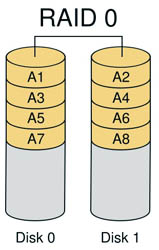
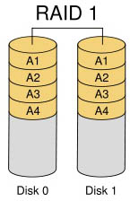
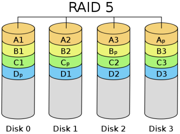
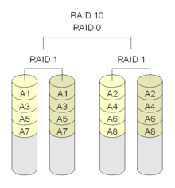

## 一、 概述

## 二、 进程管理

### 问：高响应比优先调度算法

响应比=(等待时间+服务时间)/服务时间

## 三、 内存管理

### 问：静态重定位和动态重定位

对程序进行重定位的技术按重定位的时机可分为两种：静态重定位和动态重定位。

(1) 静态重定位：是在目标程序装入内存时，由装入程序对目标程序中的指令和数据的地址进行修改，即把程序的逻辑地址都改成实际的地址。对每个程序来说，这种地址变换只是在装入时一次完成，在程序运行期间不再进行重定位。

优点：是无需增加硬件地址转换机构，便于实现程序的静态连接。在早期计算机系统中大多采用这种方案。

缺点：

> 程序的存储空间只能是连续的一片区域，而且在重定位之后就不能再移动。这不利于内存空间的有效使用。
> 
> 各个用户进程很难共享内存中的同一程序的副本。

(2) 动态重定位：是在程序执行期间每次访问内存之前进行重定位。这种变换是靠硬件地址变换机构实现的。通常采用一个重定位寄存器，其中放有当前正在执行的程序在内存空间中的起始地址，而地址空间中的代码在装入过程中不发生变化。

优点：
> 程序占用的内存空间动态可变，不必连续存放在一处。
> 
> 比较容易实现几个进程对同一程序副本的共享使用。

缺点：是需要附加的硬件支持，增加了机器成本，而且实现存储管理的软件算法比较复杂。

现在一般计算机系统中都采用动态重定位方法。

### 问：动态分区分配

(1) 首次适应(First Fit)算法

空闲分区以地址递增的次序链接。分配内存时顺序查找，找到大小能满足要求的第一个空闲分区。

该算法优先使用低址部分空闲区，在低址空间造成许多小的空闲区，在高地址空间保留大的空闲区。

(2) 最佳适应(Best Fit)算法

空闲分区按容量递增形成分区链，找到第一个能满足要求的空闲分区。

(3) 最坏适应(Worst Fit)算法，又称为最大适应(Largest Fit)算法

空闲分区按容量递减形成分区链，找到第一个能满足要求的空闲分区，也就是找出最大的分区。

(4) 邻近适应(Next Fit)算法，又称为循环首次适应算法

该算法是首次适应算法的变种，不同之处是分配时从上次查找结束的位置开始继续查找。

该算法能使内存中的空闲区分布得较均匀。

### 问：磁盘

磁盘是可共享设备，一段时间内允许多个用户进行交叉访问，同一时刻只能有一个进程访问。

### 问：磁盘平均存取时间

平均存取时间=寻道时间+延迟时间+传输时间

https://www.nowcoder.com/profile/7404313/test/7920678/52607?onlyWrong=0

### 问：RAID阵列

RAID 0：无差错控制的带区组

要实现RAID0必须要有两个以上硬盘驱动器，RAID0实现了带区组，数据并不是保存在一个硬盘上，而是分成数据块保存在不同驱动器上。在所有的级别中，RAID 0的速度是最快的。但是RAID 0没有冗余功能的，如果一个磁盘(物理)损坏，则所有的数据都无法使用。

RAID 1：镜象结构

当主硬盘损坏时，镜像硬盘就可以代替主硬盘工作。镜像硬盘相当于一个备份盘，可想而知，这种硬盘模式的安全性是非常高的，RAID 1的数据安全性在所有的RAID级别上来说是最好的。但是其磁盘的利用率却只有50%，是所有RAID级别中最低的。

RAID5：分布式奇偶校验的独立磁盘结构

RAID5最大的好处是在一块盘掉线的情况下，RAID照常工作，相对于RAID0必须每一块盘都正常才可以正常工作的状况容错性能好多了。因此 RAID5是RAID级别中最常见的一个类型。RAID5校验位即P位是通过其它条带数据做异或(xor)求得的。计算公式为 P=D0xorD1xorD2…xorDn，其中p代表校验块，Dn代表相应的数据块，xor是数学运算符号异或。

RAID10：高可靠性与高效磁盘结构

RAID 10是先镜射再分区数据。是将所有硬盘分为两组，视为是RAID 0的最低组合，然后将这两组各自视为RAID 1运作。RAID 10有着不错的读取速度，而且拥有比RAID 0更高的数据保护性。

## 四、 文件管理

## 五、 输入输出(I/O)管理

### 问：I/O控制方式

- 程序直接控制方式
- 中断驱动方式：允许I/O设备主动打断CPU的运行并请求服务，从而解放CPU，使得CPU向I/O控制器发送读命令后可以继续做其他有用的工作。
- DMA方式：在中断驱动方式中，I/O设备与内存之间的数据交换必须要经过CPU中的寄存器，所以速度受限，而DMA(直接存储器存取)方式的基本思想是在I/O设备和内存之间开辟直接的数据交换通路，彻底解放CPU。

	DMA方式的特点：
	> (1) 基本单位是数据块
	> 
	> (2) 所传送的数据，是从设备直接送入内存的，或者相反。
	> 
	> (3) 仅在传送一个或多个数据块的开始和结束时，才需要CPU干预，整块数据的传送是在DMA控制器的控制下完成的。

- 通道方式

### 问：I/O子系统的层次结构

操作系统的I/O 子系统通常由 4 个层次组成，每一层明确定义了与邻近层次的接口，其合理的层次组织排列顺序是：用户级 I/O 软件、设备无关软件、设备驱动程序、中断处理程序

## 六、Linux

### 问：umask

https://www.nowcoder.com/profile/7404313/test/7907952/15820?onlyWrong=0

### 问：netstat

netstat命令用来查看本机的传输层连接状态，如TCP、UDP连接，端口等信息

### 问：ifconfig

ifconfig是查看活动的网卡信息

### 问：tcpdump

tcpdump是简单可靠网络监控的实用工具

### 问：top显示活动进程方面的情况

## 七、 其他 

### 进程间的通信方式

- 管道( pipe )：管道是一种半双工的通信方式，数据只能单向流动，而且只能在具有亲缘关系的进程间使用。进程的亲缘关系通常是指父子进程关系。  
- 信号量( semophore ) ： 信号量是一个计数器，可以用来控制多个进程对共享资源的访问。它常作为一种锁机制，防止某进程正在访问共享资源时，其他进程也访问该资源。因此，主要作为进程间以及同一进程内不同线程之间的同步手段。   
- 消息队列( message queue ) ： 消息队列是由消息的链表，存放在内核中并由消息队列标识符标识。消息队列克服了信号传递信息少、管道只能承载无格式字节流以及缓冲区大小受限等缺点。   
- 共享内存( shared memory ) ：共享内存就是映射一段能被其他进程所访问的内存，这段共享内存由一个进程创建，但多个进程都可以访问。共享内存是最快的 IPC 方式，它是针对其他进程间通信方式运行效率低而专门设计的。它往往与其他通信机制，如信号两，配合使用，来实现进程间的同步和通信。   
- 套接字( socket ) ： 套解口也是一种进程间通信机制，与其他通信机制不同的是，它可用于不同及其间的进程通信。
- RPC

### 内存分配方式有三种：

  （1）从静态存储区域分配。内存在程序编译的时候就已经分配好，这块内存在程序的整个运行期间都存在。例如全局变量，static变量。

  （2）在栈上创建。在执行函数时，函数内局部变量的存储单元都可以在栈上创建，函数执行结束时这些存储单元自动被释放。栈内存分配运算内置于处理器的指令集中，效率很高，但是分配的内存容量有限。

  （3） 从堆上分配，亦称动态内存分配。程序在运行的时候用malloc或new申请任意多少的内存，程序员自己负责在何时用free或delete释放内存。动态内存的生存期由我们决定，使用非常灵活，但问题也最多

### 相联存储器

相联存储器（associative memory),也称为按内容访问存储器（content addressed memory)或简称为TLB(Translation Lookaside Buffer)，它是一种不根据地址而是根据存储内容来进行存取的存储器,可以实现快速地查找块表

### 大端存储和小端存储

https://www.nowcoder.com/profile/7404313/test/7907952/14799?onlyWrong=0

案例1：
	
	union X{
	    int x;
	    char y[4];
	};
	
	在小端序的机器中,如果定义X a; 
	a.x=0x11223344;//16 进制，则a.y[3]=0x11

在union 中所有的数据成员共用一个空间，同一时间只能储存其中一个数据成员，所有的数据成员具有相同的起始地址。

### 管道

管道是指用于连接一个读进程和一个写进程以实现进程之间通信的一种共享文件。向管道提供输入的是发送进程，也称为 写进程，负责向管道输入数据，数据的格式是字符流。接受管道 数据的接受进程为读进程。

